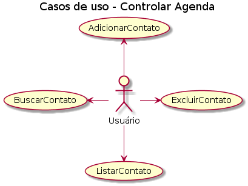

## Projeto AgendaDoMario
O projeto simplificado sobre uma agenda, tem objetivo funcional e simples.

| Funcionalidade | Explicativo| 
|--|--|
|**Adicionar um contato**|*Verifica se existe uma lista, caso não cria e em seguida lê as entradas do usuário(nome e número), e adicionado na lista em txt.*|
|**Exclua um contato**|*Verifica se existe uma lista, caso não exista avisa o usuário e caso exista ele lê a entrada do usuário(nome) e remove da lista em txt.*|
|**Busque um contato**|*Verifica se existe uma lista, caso não exista avisa o usuário e caso exista ele lê a entrada do usuário(nome) e devolve o contato seguido de nome e número.*| 
|**Liste todos contatos**|*Verifica se existe uma lista, caso não exista avisa o usuário e caso exista ele lê todo o txt e devolve nome e número de todos que foram cadastrados.*|

## Motivação
Vale provavelmente muita nota, acredito que seja a melhor motivação para um trabalho.

## Documentação

**Caso de Uso**

**Diagrama de Classe**

**Diagrama de Sequência**

## Screenshots
Print das funcionalidades pelo CMD.

**MENU**

**INSIRA UM CONTATO**

**EXCLUA UM CONTATO**

**BUSQUE UM CONTATO**

**LISTE TODOS CONTATOS**

**Exemplo das funcionalidades**

## Features
Caso o Mario não esteja satisfeito apenas com essa agenda, teremos atualizações então aguarde capítulos novos.

## Instalação
Roda o .jar no cmd que ta top.
Abre seu cmd e coloca isso java -jar "C:\"pastacriada"\Agenda.jar";
"pasta criada" é o seu nome de pasta;

## Creditos
Agradeço muito a meu esforço próprio e ao W3Schools que ajudou nos métodos. 

## License
Pode usar a vontade minha agenda desde que deixe meu nome no final ta top.(PAF-ECF, Thiago Romão).

PAF-ECF [Thiago Romão]()

**TCHAU**

